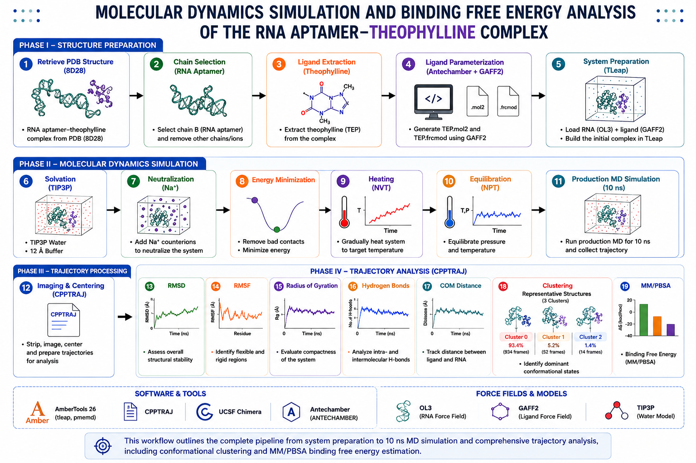
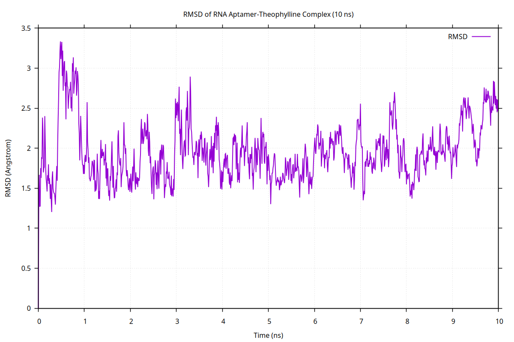
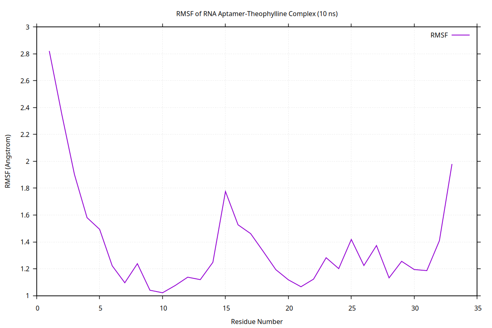
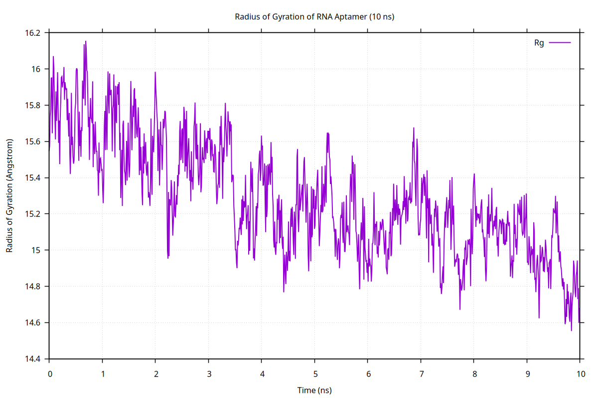
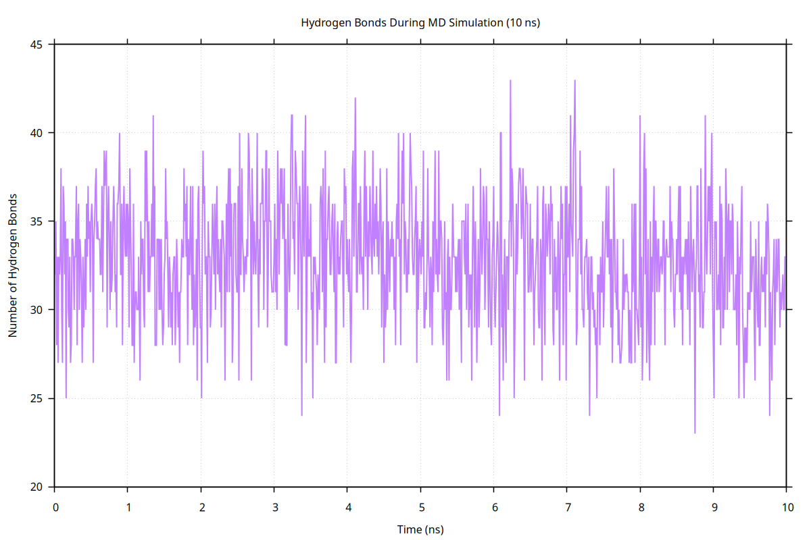
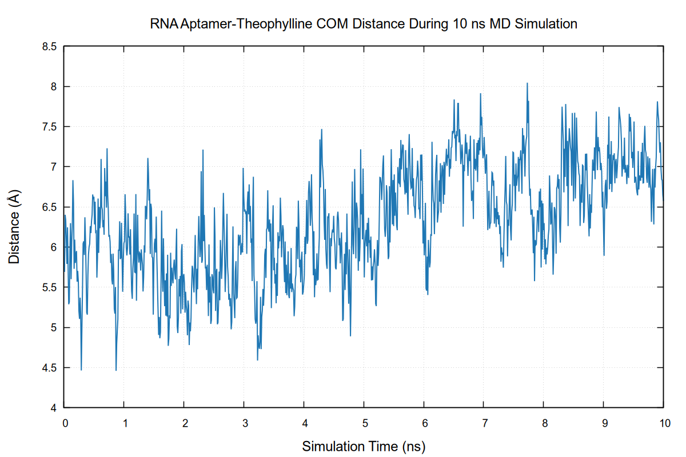
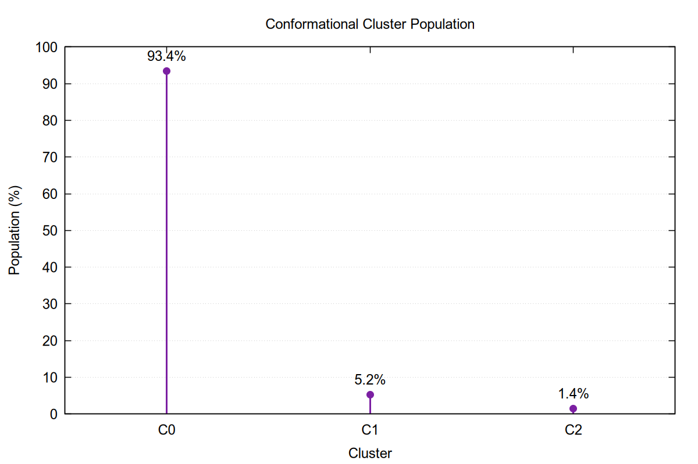
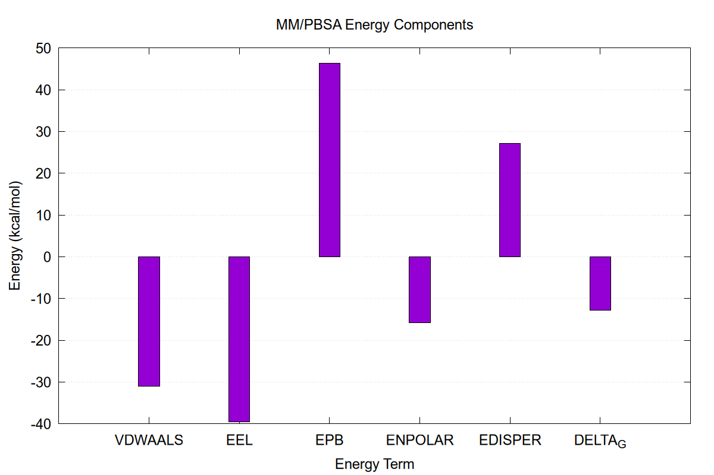

# Molecular Dynamics Simulation and Binding Free Energy Analysis of the RNA Aptamer–Theophylline Complex

<p align="center">

</p>

<p align="center">


</p>

---

# Project Overview

This repository presents a complete computational molecular dynamics workflow for the **RNA aptamer–theophylline complex (PDB ID: 8D28)**, including **system preparation**, **molecular dynamics (MD) simulation**, **trajectory analysis**, and **MM/PBSA binding free energy estimation** using **AmberTools 26**.

Beginning with RNA and ligand preparation, the workflow progresses through ligand parameterization, system construction, explicit solvent molecular dynamics simulation, trajectory processing, and comprehensive structural analyses using widely adopted computational chemistry tools.

The objective of this project was to investigate the structural stability, conformational flexibility, intermolecular interactions, and binding behaviour of the RNA aptamer–theophylline complex through molecular dynamics simulations and post-simulation analyses.

---

# Project Summary

| Item | Details |
|------|---------|
| Molecular Complex | RNA Aptamer–Theophylline |
| PDB ID | 8D28 |
| RNA Chain | Chain B |
| Ligand | Theophylline (TEP) |
| Force Field (RNA) | OL3 |
| Force Field (Ligand) | GAFF2 |
| Water Model | TIP3P |
| Simulation Software | AmberTools 26 |
| Production Simulation | 10 ns |
| Trajectory Analysis | CPPTRAJ |
| Binding Free Energy | MM/PBSA |
| Visualization | UCSF Chimera |
| Operating System | Ubuntu 26.04 LTS |

---

# Repository Structure

```text
RNA-Aptamer-Theophylline-Molecular-Dynamics/

├── figures/
│   └── workflow.png
│
├── inputs/
│   ├── eq_npt.in
│   ├── heat.in
│   ├── min.in
│   ├── prod.in
│   ├── prod2.in
│   ├── prod3.in
│   ├── prod4.in
│   └── tleap.in
│
├── structures/
│   ├── 8D28.pdb
│   ├── 8D28_chainB.pdb
│   ├── combined_10ns_image.pdb
│   ├── complex_solvated.pdb
│   ├── TEP.frcmod
│   ├── TEP.mol2
│   └── TEP.pdb
│
├── topology/
│   ├── complex.inpcrd
│   └── complex.prmtop
│
├── scripts/
│   ├── combine.in
│   ├── image.in
│   ├── image_10.in
│   └── pdb_10.in
│
├── results/
│   ├── Cluster/
│   ├── COM_Distance/
│   ├── Hydrogen_Bonds/
│   ├── MMPBSA/
│   ├── Radius_of_Gyration/
│   ├── RMSD/
│   └── RMSF/
│
├── README.md
├── LICENSE
├── .gitignore
└── CITATION.cff
```

---

# Computational Workflow

The complete computational workflow followed in this project is illustrated below.

| Step | Description |
|------|-------------|
| 1 | RNA aptamer and ligand preparation |
| 2 | Ligand parameterization using Antechamber and GAFF2 |
| 3 | System preparation using TLeap |
| 4 | Solvation and system neutralization |
| 5 | Energy minimization |
| 6 | Heating |
| 7 | Equilibration |
| 8 | Production molecular dynamics simulation |
| 9 | Trajectory processing using CPPTRAJ |
| 10 | Structural analysis |
| 11 | MM/PBSA binding free energy calculation |
| 12 | Visualization using UCSF Chimera |

---

# RNA and Ligand Preparation

The experimentally determined **RNA aptamer–theophylline complex (PDB ID: 8D28)** was selected as the starting structure for molecular dynamics simulations.

The RNA aptamer (**Chain B**) and the bound **theophylline (TEP)** ligand were extracted from the crystal structure and prepared for molecular dynamics simulations.

---

## Ligand Parameterization

The **theophylline (TEP)** ligand was parameterized using **Antechamber** with the **General AMBER Force Field 2 (GAFF2)**.

Missing ligand parameters were generated using **Parmchk2**, and the resulting parameter files were incorporated into the simulation system using **TLeap**.

### Generated Files

| File | Description |
|------|-------------|
| `TEP.mol2` | Ligand structure with assigned atom types and charges |
| `TEP.frcmod` | Additional force field parameters generated by Parmchk2 |

---

# Molecular Dynamics Simulation

Following RNA and ligand preparation, the complete simulation system was constructed and prepared for molecular dynamics simulations using **AmberTools 26**.

The molecular dynamics workflow included:

- System preparation
- Topology generation
- Explicit solvation
- Energy minimization
- Heating
- Equilibration
- Production molecular dynamics simulation
- Trajectory processing
- Structural analysis
- MM/PBSA binding free energy estimation

---

## System Preparation

The RNA aptamer and theophylline ligand were assembled into a single simulation system using **TLeap**.

The RNA was parameterized using the **OL3 RNA force field**, while the ligand was parameterized using the **General AMBER Force Field 2 (GAFF2)**. The complex was solvated in a **truncated octahedral TIP3P water box** with a **12 Å solvent buffer**, followed by the addition of **Na⁺ counterions** to neutralize the system.

### Generated Files

| File | Description |
|------|-------------|
| `complex.prmtop` | AMBER topology file for the solvated RNA–ligand complex |
| `complex.inpcrd` | Initial coordinate/restart file |
| `complex_solvated.pdb` | Solvated RNA–ligand complex structure |

---

## Energy Minimization

Energy minimization was performed to remove unfavorable steric interactions and optimize the solvated system prior to molecular dynamics simulations.

The minimization protocol consisted of an initial restrained minimization to relax solvent molecules, followed by an unrestrained minimization of the entire system.

---

## Heating

The minimized system was gradually heated from **0 K to 300 K** under **constant volume (NVT)** conditions while applying positional restraints to the RNA aptamer.

This gradual heating protocol minimizes structural distortions before equilibration.

---

## Equilibration

Following heating, the system was equilibrated under **constant pressure and temperature (NPT)** conditions to stabilize the system density and allow the solvent environment to relax prior to the production simulation.

---

## Production Molecular Dynamics

Following equilibration, a **10 ns production molecular dynamics simulation** was performed to investigate the structural behaviour of the **RNA aptamer–theophylline complex**.

Trajectory processing and structural analyses were subsequently carried out using **CPPTRAJ**.

---

# Trajectory Analysis

Comprehensive trajectory analyses were performed to evaluate structural stability, conformational flexibility, intermolecular interactions, and binding behaviour throughout the molecular dynamics simulation.

---

## Root Mean Square Deviation (RMSD)

RMSD was calculated to monitor the overall structural stability of the RNA aptamer throughout the production simulation.

<p align="center">

</p>

---

## Root Mean Square Fluctuation (RMSF)

Residue-wise flexibility was evaluated using RMSF to identify regions exhibiting increased atomic fluctuations during the simulation.

<p align="center">

</p>

---

## Radius of Gyration (Rg)

The Radius of Gyration was calculated to assess changes in the overall structural compactness of the RNA aptamer throughout the simulation.

<p align="center">

</p>

---

## Hydrogen Bond Analysis

Hydrogen bond analysis was performed to evaluate the stability of intermolecular hydrogen-bonding interactions between the RNA aptamer and theophylline throughout the simulation.

<p align="center">

</p>

---

## Center of Mass Distance

The center of mass (COM) distance between the RNA aptamer and theophylline ligand was monitored throughout the simulation to evaluate the stability of ligand binding.

<p align="center">

</p>

---

## Conformational Clustering

Trajectory clustering was performed using **CPPTRAJ** to identify the dominant conformational states sampled during the molecular dynamics simulation.

Representative structures from the most populated clusters were extracted to characterize the major conformational states observed during the simulation.

<p align="center">

</p>

---

## MM/PBSA Binding Free Energy

The binding free energy of the RNA aptamer–theophylline complex was estimated using the **Molecular Mechanics/Poisson–Boltzmann Surface Area (MM/PBSA)** method.

The calculation provides an estimate of the binding affinity by combining molecular mechanics energies with implicit solvent contributions.

<p align="center">

</p>

---

# Molecular Dynamics Visualization

The processed molecular dynamics trajectory of the **RNA aptamer–theophylline complex** was visualized using **UCSF Chimera**.

<p align="center">

</p>

The animated preview above illustrates the complete **10 ns molecular dynamics trajectory** at an accelerated playback speed. The complete trajectory is also provided as an MP4 video.

**Full Trajectory (MP4)**

[▶ Watch the complete molecular dynamics trajectory](Movie/md_simulation.mp4)

---

# Computational Tools

| Software | Purpose |
|----------|---------|
| AmberTools 26 | Molecular Dynamics Simulation |
| TLeap | System Preparation |
| Antechamber | Ligand Parameterization |
| Parmchk2 | Force Field Parameter Generation |
| CPPTRAJ | Trajectory Processing and Analysis |
| MM/PBSA.py | Binding Free Energy Calculation |
| GNU Plot | Scientific Data Visualization |
| UCSF Chimera | Molecular Visualization |
| Ubuntu 26.04 LTS | Computational Environment |

---

# Project Outcomes

- Successfully prepared the RNA aptamer–theophylline complex for molecular dynamics simulations.
- Parameterized the theophylline ligand using GAFF2 and integrated it with the RNA system using the OL3 force field.
- Constructed and solvated the simulation system using a truncated octahedral TIP3P water box.
- Completed a 10 ns molecular dynamics simulation using AmberTools 26.
- Evaluated structural behaviour using RMSD, RMSF, Radius of Gyration, Hydrogen Bond, Center of Mass Distance, and Conformational Clustering analyses.
- Estimated the binding free energy of the RNA aptamer–theophylline complex using the MM/PBSA method.
- Visualized molecular structures and trajectories using UCSF Chimera.

---

# Reproducibility

This repository is organized as a complete molecular dynamics simulation workflow.

The provided input files, molecular structures, topology files, analysis scripts, and simulation outputs allow each stage of the project—from system preparation to trajectory analysis and binding free energy estimation—to be reproduced and studied independently.

---

# AI Assistance

OpenAI ChatGPT was used to assist with repository organization, documentation, workflow visualization, and README preparation.

All molecular dynamics simulations, trajectory analyses, MM/PBSA calculations, interpretation of results, and scientific conclusions presented in this repository were independently performed by the author using the computational tools described above.

---

# References

1. Case D.A. *et al.* **AmberTools User Manual.**

2. Roe D.R., Cheatham T.E. III. *PTRAJ and CPPTRAJ: Software for Processing and Analysis of Molecular Dynamics Trajectory Data.* *Journal of Chemical Theory and Computation*, 2013.

3. Wang J., Wolf R.M., Caldwell J.W., Kollman P.A., Case D.A. *Development and Testing of a General AMBER Force Field.* *Journal of Computational Chemistry*, 2004.

4. Pettersen E.F. *et al.* *UCSF Chimera—A Visualization System for Exploratory Research and Analysis.* *Journal of Computational Chemistry*, 2004.

---

# Citation

If you use this repository for research, teaching, or learning purposes, please cite the accompanying **CITATION.cff** file.

---

# License

This project is distributed under the **MIT License**.

See the **LICENSE** file for complete license information.

---

# Author

**Parash Upreti**

*M.Pharm (Pharmaceutical Chemistry) Student*

### Research Interests

- Computer-Aided Drug Design (CADD)
- Molecular Dynamics Simulation
- RNA Structural Biology
- Computational Drug Discovery
- Molecular Modeling
- AI in Drug Discovery

---

⭐ **If you found this repository useful, consider giving it a star.**